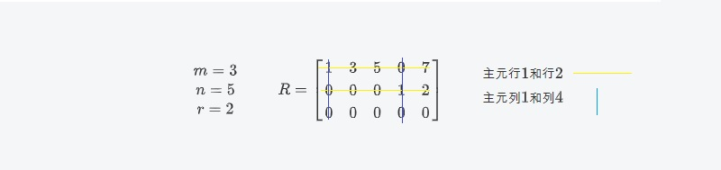

## 3.5 四个子空间的维度

------

1	列空间$ C(A)$和行空间$C(A^T)$ 的维数 $r$ (矩阵$A$的秩) 。

2	零空间的维数是 $n-r$。左零空间$N(A^T)$的维数是$m-r$

3	

4

5

------

​		本章主要把秩与维数关联起来。矩阵的秩是主元的个数。子空间的维数是一组基的向量数量。我们计算出主元或者基向量的个数。通过$A$的秩可以得到四个基本子空间的维数。下面是这些子空间，其中包括了一个将要学的。

​		两个子空间从$A$直接得到，另外两个从$A^T$中得到。

​			四个基本子空间($A_{m\times n}$)：

​			1 行空间记作$C(A^T)$，$R^n$的一个子空间。

​			2 列空间记作$C(A)$，$R^m$的一个子空间。

​			3 零空间记作$N(A)$，$R^n$的一个子空间。

​			4 左零空间记作$N(A^T)$，$R^m$的一个子空间。这个是一个将要学的空间。

---

​	本书最先提到的是列空间。我们对$C(A)$和$N(A)$非常了解。现在来看另外两个子空间。行空间包含了行的所有组合。A的行空间是$A^T$的列空间。

​	对于左零空间我们解出$A^Ty=0$，$A^T$是$n \times m$，得到的就是$A^T$的零空间。当把等式转换为***y***$^TA=0^T$时，向量***y***就被移到$A$的左边。矩阵$A$和转置矩阵$A^T$当然不同，他们的列空间和零空间也不一样。但是这些空间用一种非常美妙的方式联系在一起了。

​	基本定理的第一部分给出了四个基本子空间的维数。一个很明显的事实是:**行空间和列空间拥有相同的维数*r*。** ***r***是矩阵的秩。另一个重要的事实涉及到两个子空间：

**$N(A)$和$N(A^T)$的维数分别是*n-r* 和 *m-r*,合起来正好是*n*和*m。***(译者注:$C(A^T)$是$R^n$中的$r$维，$N(A)$是$R^n$中的$n-r$维，$C(A)$是$R^m$中的r维,$N(A^T)$是$R^m$中的$m-r$维)

​	基本定理的第二部分会描述出四个子空间如何组合在一起(两个在$R^n$空间中，两个在$R^m$空间中)。这就是理解所有 ***Ax=b***的正确方法。坚持下去，你在做真正的数学。

### 																									R的四个子空间

使***A***化简为行阶梯型***R***，对于这个特殊的形式，四个子空间很容易去辨别。我们将找出每一个子空间的一组基并且得到他的维数。然后我们看看这些子空间如何变化（其中的两个不会变化）。最重要的一点是四个空间的维数对于***A***和***R***来说是相同的。

​	以一特殊的3$\times$5矩阵为例，观察阶梯型矩阵***R***的四个子空间:
$$
m=3\\
n=5\\
r=2\\
R=
\left[
 \begin{matrix}
  1&3&5&0&7\\
  0&0&0&1&2\\
  0&0&0&0&0
  \end{matrix} 
\right]\\
主元行1和行2 \\
主元列1和列4
$$
这个矩阵的秩是2(两个主元)。按照顺序得出四个子空间。	

1 R的行空间的维数是2，和秩一样。

​	**理由:** 前两行是一组基。行空间包含所有三个行的组合，但是第三行（零行）不能添加任何新的组合。所以行1和行2组成了行空间$C(R^T)$。

​		主元行1和行2是线性无关的，对于这个例子来说这是显而易见的，并且他总是成立的。如果我们只看主元列，我们发现r$  \times $r的单位矩阵。没有办法使行组合起来得出零行（除非组合系数均为0）。所以r 主元行是行空间的一组基。

<b>行空间的维数是秩r。非零行组成一组基</b>

2 R的列空间的维数也是2

**理由:**主元列1和4形成$C(R)$的一组基。它们是线性无关的由于他们开始于$r \times r$单位矩阵。这些主元列进行组合后无法得到零列（除非组合系数全部为0）。所以他们也生产列空间。其他的（自由）列是主元列的线性组合。实际上我们需要的组合就是三个特解。

​		**列2**等于**3**倍的**列1**。特解就是$(-3,1,0,0,0)$

​		**列3**等于**5**倍的**列1**。特解就是$(-5,0,1,0,0）$

​		**列5**等于**7**倍的**列1**加上**2**倍的**列4**。特解就是$(-7,0,0,-2,1)$

主元列是线性无关的，他们生成空间，所以他们是$C(R)$的一组基。

<b>列空间的维数是秩r。非零列组成一组基</b>
